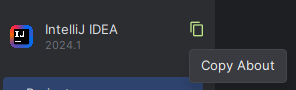
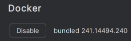

# Labo01 - Environment Setup

* [Labo description](https://cpnv-es-ngy.gitbook.io/vir1/labs/labo01-environment-setup)

## DevOps Stack to setup

Mention in this documentation the orders carried out and the results obtained.

If you have opted for a graphical installation, provide screenshots and describe the procedure up to the result obtained.

### Cloud cmd line interface - AWS Cli

```sh
aws --version

#aws-cli/2.15.39 Python/3.11.8 Windows/10 exe/AMD64 prompt/off
```

### IDE - Intellij

```sh
# Install InteliJ IDEA Ultimate (minimum 2024)
# https://www.jetbrains.com/idea/download/?section=windows
```



```sh
IntelliJ IDEA 2024.1 (Ultimate Edition) # <-- Important
Build #IU-241.14494.240, built on March 28, 2024 # <-- Important
Licensed to Benjamin Fontana
Subscription is active until April 17, 2025.
For educational use only.
Runtime version: 17.0.10+8-b1207.12 amd64
VM: OpenJDK 64-Bit Server VM by JetBrains s.r.o.
Windows 11.0
GC: G1 Young Generation, G1 Old Generation
Memory: 2048M
Cores: 8
Registry:
  ide.experimental.ui=true
Non-Bundled Plugins:
  com.intellij.plugins.vscodekeymap (241.14494.150)
  com.github.copilot (1.5.2.5345)
  com.mallowigi (95.0.0)
Kotlin: 241.14494.240-IJ
```

### Containers Engins - Docker

```sh
docker --version

#Docker version 26.0.0, build 2ae903e
```

### Versioning - Git + Git flow

```sh
choco upgrade git

git --version

#git version 2.44.0.windows.1
```

### IDE Plugin - Docker plugin for IntelliJ

```sh
# Install docker plugin from JetBrains
# https://plugins.jetbrains.com/plugin/7724-docker/versions#tabs
```



### Development Kit - JDK

```sh
# Install JDK
# https://www.oracle.com/java/technologies/downloads/#jdk17-windows

java --version
# java 17.0.11 2024-04-16 LTS
# Java(TM) SE Runtime Environment (build 17.0.11+7-LTS-207)
# Java HotSpot(TM) 64-Bit Server VM (build 17.0.11+7-LTS-207, mixed mode, sharing)
```

### Package manager - Maven

```sh
choco install maven

mvn --version

# Apache Maven 3.9.6 (bc0240f3c744dd6b6ec2920b3cd08dcc295161ae)
# Maven home: C:\ProgramData\chocolatey\lib\maven\apache-maven-3.9.6
# Java version: 17.0.11, vendor: Oracle Corporation, runtime: C:\Program Files\OpenJDK\jdk-17.0.11
# Default locale: en_GB, platform encoding: Cp1252
# OS name: "windows 11", version: "10.0", arch: "amd64", family: "windows"
```

## Schema

Show your development environment, mentioning all the components in the stack.

Identify the links between components.


## Analysis

Answer the questions below, giving reasons for your answer (link, source).

### AWS CLI

* How does the AWS Cli interact with the cloud ?

```sh
#It sends requests through https on an AWS cloud server

# https://docs.aws.amazon.com/cli/latest/userguide/cli-chap-using.html
```

* What other ways do we have of dialoguing/interacting with the AWS cloud if we wanted to do without the CLI?

```sh
# Using their online console
# https://aws.amazon.com/console/
```

* What commands do I need to run in the CLI to start an ec2 instance?

```sh
# https://docs.aws.amazon.com/cli/latest/reference/ec2/start-instances.html
aws ec2 start-instances --instance-ids "{id}"
```

### Docker Engine

* What type of hypervisor does Docker use?

```sh
# https://docs.docker.com/get-started/overview/#running-more-workloads-on-the-same-hardware
# https://www.quora.com/What-hypervisor-does-Docker-use
# None it uses containerization instead
```

* What role does the Docker Desktop play in the Docker architecture?

```sh
# https://docs.docker.com/desktop/
# It helps users to have a global overview of their resources such as containers, images, volumes, etc...
# It also help to manage the containers and images.
```

### Java Environment

* JDK, JRE, JVM... what's the difference?

```sh
# https://www.geeksforgeeks.org/differences-jdk-jre-jvm/

# JDK: Java Development Kit, it contains the JRE and the tools needed to develop Java applications.

# JRE: Java Runtime Environment, it contains the JVM and the libraries needed to run Java applications.

# JVM: Java Virtual Machine, it is the environment in which Java applications are executed.
```

### Maven

* What is the command you need to use Maven to retrieve dependencies (and only that)?

```sh
# https://maven.apache.org/plugins/maven-dependency-plugin/resolve-mojo.html
mvn dependency:resolve
```
