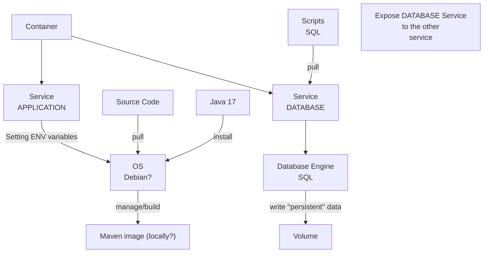

# Labo02 - Run a Spring App Locally

## Pedagogical intent

In this lab, we'll be taking the application we're going to evolve into our own hands, to discover the Spring architecture.

---

## Task 01 - Run the app

### Use Maven to package the solution

* [Maven Doc](https://maven.apache.org/guides/getting-started/maven-in-five-minutes.html#build-the-project)

```bash
mvn package
```

* What operation does maven perform ?

| PLUGIN                         | PHASE                  | ID                           | GOAL          |
| ------------------------------ | ---------------------- | ---------------------------- | ------------- |
| maven-enforcer-plugin          | validate               | enforce-java                 | enforce       |
| spring-javaformat-maven-plugin | validate               | default                      | validate      |
| maven-checkstyle-plugin        | validate               | nohttp-checkstyle-validation | check         |
| jacoco-maven-plugin            | initialize             | default                      | prepare-agent |
| git-commit-id-maven-plugin     | initialize             | default                      | revision      |
| spring-boot-maven-plugin       | generate-resources     | default                      | build-info    |
| maven-resources-plugin         | process-resources      | default-resources            | resources     |
| maven-compiler-plugin          | compile                | default-compile              | compile       |
| maven-resources-plugin         | process-test-resources | default-testResources        | testResources |
| maven-compiler-plugin          | test-compile           | default-testCompile          | testCompile   |
| maven-surefire-plugin          | test                   | default-test                 | test          |
| jacoco-maven-plugin            | prepare-package        | report                       | report        |
| maven-jar-plugin               | package                | default-jar                  | jar           |
| spring-boot-maven-plugin       | package                | repackage                    | repackage     |
| maven-install-plugin           | install                | default-install              | install       |
| maven-deploy-plugin            | deploy                 | default-deploy               | deploy        |

> mvn fr.jcgay.maven.plugins:buildplan-maven-plugin:list

* What java dependencies are needed to make this work?

 | GroupId                  | ArtifactId                     |
 | ------------------------ | ------------------------------ |
 | org.springframework.boot | spring-boot-starter-actuator   |
 | org.springframework.boot | spring-boot-starter-cache      |
 | org.springframework.boot | spring-boot-starter-data-jpa   |
 | org.springframework.boot | spring-boot-starter-web        |
 | org.springframework.boot | spring-boot-starter-validation |
 | org.springframework.boot | spring-boot-starter-thymeleaf  |
 | org.springframework.boot | spring-boot-starter-test       |

* Where do we find the pre-compiled application after that?

```sh
# ./target/spring-petclinic-3.2.0.SNAPSHOT.jar
```

* Delete the folder containing the pre-compiled application, try again to observe the process.

* Is it a build ready for prod ?

```bash
# Well technically yes, it's the pre-production build. It's just not released yet. It's like a dev production build.
```

### Use Java to launch the application

* [The java command](https://docs.oracle.com/en/java/javase/14/docs/specs/man/java.html)

```bash
java -jar ./target/spring-petclinic-3.2.0.SNAPSHOT.jar
```

* Try to access to the app via your browser

```bash
localhost:8080
```

* You should get this page


* Stop the app

## Use the Spring Boot Maven plugin to launch the application

* [Maven plug in to run the app](https://docs.spring.io/spring-boot/docs/current/maven-plugin/reference/htmlsingle/#run)

```bash
mvn spring-boot:run
```

---

## Task 02 - Explore the app

### Kind of app

* How can we access a home page via our browser?

```bash
http://localhost:8080/
```

* Go to <http://localhost:8080/owners/find> and add an owner

* Using the search function, can you find it? ✅

* Relaunch the application and try again. How is data persistence ensured?

```bash
# no data persistence whilst no database is connected
```

* How many logic layers are implemented on this application?


---

## Task 03 - Docker - First Analysis

* At this stage of the analysis, can you imagine a little better what kind of needs Docker could help us with?

```sh
# Yes, we could use Docker to host the database engine. Also, we could use Docker to host the application part locally.
```

* Try to list the tasks to be carried out to obtain two thirds, one hosting the application part locally and the second third using Docker for the database engine.



```sh
# 1. Create a Dockerfile to build the application
# 1.1 Install Java 17
# 1.2 Set the environment variables
# 1.3 Install Maven
# 1.4 pull the source code into the container

# 2. Create a Dockerfile to build the database engine
# 3. Create a docker-compose file to orchestrate the two containers
```
