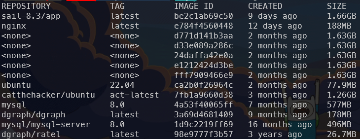

# Labo03 - Run a first container

## Pedagogical intent

In this lab, you'll:

* Get to grips with the first Docker commands,
* Run your first Docker
* Familiarize yourself with port publishing

---

Note: the docker engine must be running

## Task 01 - Get to grips with the first Docker commands

* List all images present on your installation

[INPUT]

```bash
docker images
```

[OUTPUT]


* Get the official Nginx image using this command

[INPUT]

```bash
docker pull nginx
```

[OUTPUT]


Note : do you see the different layer uploaded ?

* List -again- all image present on your installation

[INPUT]

```bash
docker images
```

[OUTPUT]



Note : 188 MB is the size of your image... check it.

* List -again- all image present on your installation

[INPUT]

```bash
docker images
```

[OUTPUT]


* List all Docker

[INPUT]

```bash
docker ps -a
```

[OUTPUT]


## Task 02 - Run the container

* Run Nginx Docker

[INPUT]

```bash
docker run nginx
```

[OUTPUT]


* Can you reach the default page of nginx

No because the container is not listening on port 80

Note : By default, Nginx is listening on port 80

[INPUT]

```bash
curl localhost
```

[OUTPUT]


* Stop this first attempt

[INPUT]

```bash
docker stop <id>
# or ctrl+c because the container is running in the foreground (-d option is not used)
```

[OUTPUT]


## Task 03 - Familiarize yourself with port publishing

* Make it possible to reach nginx with this command

[Publish a port](https://docs.docker.com/network/#published-ports)

```bash
docker run -d -p 8080:80 nginx
```

[INPUT]

```bash
curl localhost:8080
```

[OUTPUT]


* Stop and delete the container

[INPUT]

```sh
docker stop d723cd20f6cb
docker rm d723cd20f6cb
```

[OUTPUT]

```sh
d723cd20f6cb
d723cd20f6cb
```

* Delete the image

[INPUT]

```sh
docker rmi nginx
```

[OUTPUT]

```sh
Untagged: nginx:latest
Untagged: nginx@sha256:a484819eb60211f5299034ac80f6a681b06f89e65866ce91f356ed7c72af059c
Deleted: sha256:e784f4560448b14a66f55c26e1b4dad2c2877cc73d001b7cd0b18e24a700a070
Deleted: sha256:38ecd4de01b55beb32c596678b061db27f8ecb586096f031e4553869e52a1dc2
Deleted: sha256:168e1116c229abdf6cd9c0f07f82d40d53e358b1da4e1242a15101ece28ccb28
Deleted: sha256:0b7dc712f354a2312c1f1bb6380d8e23919baf0cc09f32a5a4595afb6c3a440b
Deleted: sha256:3ecb32a94af1f9a46cc259bf6cc677acd1fef2023f746e973862d1a8c9e31fe3
Deleted: sha256:b4c8fa0ae3e9f4f7d0ee49a9ac13d8aebd6f2d4a53e204e75f74e4bcb143132f
Deleted: sha256:cd5b03306052e1a435b98a34cd2579dc48f8f0ca280a147f19f066ddb6a0b81d
Deleted: sha256:5d4427064ecc46e3c2add169e9b5eafc7ed2be7861081ec925938ab628ac0e25
```
